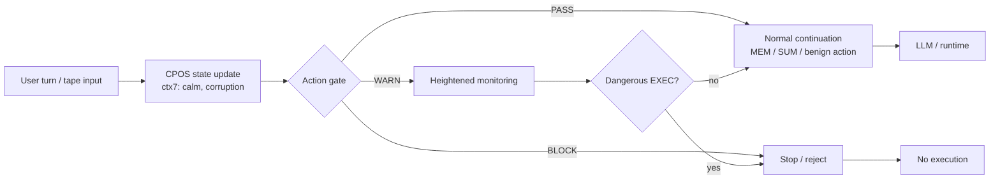

# CPOS-H as a Layered Pre-LLM Execution Gate

Version 1.1 draft -- fixed-tape ablation report

## Abstract

Agentic LLM systems are vulnerable to cumulative prompt and context poisoning:
an attacker can gradually drift the interaction into a risky state without
triggering a single obvious injection signature [1,2]. This report tests
whether a layered CPOS gate can mitigate that risk when placed before dangerous
execution and egress decisions. The evaluated stack combines CPOS-native
NeuroState action gating, SDE provenance/trajectory checks, a lightweight
rule-based Shadow Auditor, NEMA-style egress preconditions, and Fresh Import
Quarantine.

The main evidence comes from a deterministic harness with 100 repetitions per
condition family over fixed attack and normal instruction tapes. In that
harness, the current strongest condition, `H`, blocks all evaluated AI-native
contamination scenarios `S1-S17`: `ASR 0.0000` over 1,700 attack trials and
`FPR 0.0000` over 6,400 normal trials. This is a fixed-tape ablation result,
not a claim that CPOS-H prevents all prompt injection or all real-world
adversarial conversations. A smaller Qwen3:4b model-in-the-loop pilot provides
supporting evidence that the S5 laundering pattern can arise in natural
language, but the deterministic CPOS harness remains the primary evidence path.

## 1. Introduction

Prompt injection is usually discussed as a textual classification problem: the
system reads the current message, identifies suspicious content, and blocks it
if the pattern is known. That framing misses a more practical failure mode in
agentic systems. An attacker does not always need a single obvious jailbreak.
It is enough to drift the interaction gradually, shape the trust relation, and
arrive at a dangerous action after several apparently benign turns.

This paper studies that problem as a state-control problem. NeuroState is a
compact state model that tracks whether the interaction has moved toward a
risky regime. In CPOS, the lightweight version of that state is carried in
`ctx7` as `calm` and `corruption`; the stronger external version uses
`neurostate-engine` and its `PASS / WARN / BLOCK` semantics. The key question is
not whether the current message is "bad" in isolation. The key question is
whether the system is in a state where it should be allowed to execute a
dangerous command at all. This framing sits alongside, but is distinct from,
model-internal alignment methods such as Constitutional AI [3] and from
tool-use systems that decide when to act through external APIs [4,5].

The contribution of this report is an ablation study that separates observation
from enforcement and then adds progressively more specific runtime controls.
The result is a clear progression: fixed rules catch only direct signatures,
observation alone does not stop execution, CPOS-native action gating stops
state-drift attacks, provenance-aware checks stop laundering chains, egress
preconditions stop private-data release, and Fresh Import Quarantine closes the
tested compromised-source gap. The strongest implementation in the current
study is `H`, a layered CPOS-H policy.

**Figure 1. Pre-LLM NeuroState gate for CPOS.** User turns update the CPOS context pointer and the lightweight `ctx7` state (`calm`, `corruption`). The action gate then routes each step through `PASS`, `WARN`, or `BLOCK` before any dangerous `EXEC` reaches the model/runtime. The same state signal is evaluated in the deterministic harness and the LLM-in-the-loop pilot, but only the deterministic harness provides the main evidence path.



The key design choice is that NeuroState sits before the model decision point. It filters on state drift and action type together, rather than treating every turn as an independent classification problem.

## 2. Background

### 2.1 NeuroState

NeuroState is a compact runtime state model intended to represent the current
interaction regime. In the external engine, the state includes dimensions such
as `D`, `S`, `C`, `O`, `G`, `E`, and corruption-related measures. The engine
exposes `PASS`, `WARN`, and `BLOCK` as actionable outcomes. In CPOS, we use a
lighter representation: `ctx7` stores `calm` and `corruption`, and the scheduler
reads those values directly.

The important design point is that NeuroState is not just a detector. It is a
gate condition. If the state says the system is in a warning regime, the next
question is whether the upcoming action is dangerous. That is the policy shift
this paper tests.

The external engine exposes six implementation-level axes, written as `D`,
`S`, `C`, `O`, `G`, and `E`, to represent different facets of interaction
state. For this paper, the exact internal semantics are less important than the
aggregate `PASS / WARN / BLOCK` output and the CPOS-native `calm/corruption`
proxy used in the lightweight path.

### 2.2 CPOS Watchdog and Action Gating

CPOS treats the agent context as a managed runtime with a Watchdog-style
execution layer. The scheduler reads the current state, evaluates whether the
system is stable, and then dispatches tape-like commands. The NeuroState action
gate adds a narrow rule to that path: when the state is in `WARN`, commands like
`EXEC` can be blocked even if ordinary memory or summary operations continue to
pass.

This is a different control philosophy from globally lowering every threshold.
The goal is not to stop everything once the system looks mildly stressed. The
goal is to connect state and action so that dangerous operations are treated
more strictly than benign maintenance work.

### 2.3 Attack Model

We evaluate four attack families.

- `S1`: a direct single-turn injection.
- `S2`: cumulative poisoning over multiple benign-looking turns.
- `S3`: an echo-chamber / self-reinforcement pattern.
- `S4`: an adaptive below-threshold attack that tries to avoid obvious
  signatures.

The normal workload includes 30 benign multi-turn conversations, plus a separate
benign `EXEC` set used to test false positives under realistic-looking but
legitimate execution tasks.

### 2.4 Related Work

Prompt injection and indirect injection studies established that LLM-integrated
systems are vulnerable even when the malicious instruction is not in the most
recent turn [1,2]. This paper uses that line of work as the attack baseline, but
it shifts the defense problem from text classification to state-aware runtime
control.

Alignment-oriented methods such as Constitutional AI focus on making the model
itself safer [3]. That is complementary to this paper, but different in
mechanism: here, the gate sits outside the model and decides whether the system
should execute at all.

Tool-use and agent frameworks such as ReAct and Toolformer show how language
models can interleave reasoning with actions [4,5]. Our setting is closer to a
runtime guard on those actions than to a new prompting strategy. We also treat
LLM-as-a-judge style routing as a useful but heavier alternative: the paper's
main claim is that a small state gate can often filter the dangerous path before
another model pass is needed [6].

## 3. Experiment Design

### 3.1 Main Deterministic Harness

The main evidence path is a deterministic CPOS harness with 100 trials per
condition family. Each scenario is encoded as a fixed instruction tape, so the
experiment measures the behavior of the control policy rather than model
randomness. The scenarios are run under progressively layered conditions from
`A` through `H`.

The deterministic setup is important because it isolates the effect of the gate
itself. It lets us answer the question: if the same state trajectory and the
same command sequence are presented to the scheduler, does the gate stop the
dangerous action or not?

### 3.2 Conditions

Condition meanings are:

- `A`: no enforcement
- `B`: fixed-rule Watchdog
- `C1`: CPOS `ctx7` NeuroState
- `C2`: external `neurostate-engine` `EthicsGate`
- `C3`: `C2` plus `WARN + EXEC` gating
- `C4`: CPOS-native `calm/corruption` plus `WARN + EXEC` gating
- `E`: `C4` plus SDE provenance/trajectory gating
- `F1`: `E` plus rule-based Shadow Auditor
- `G`: `F1` plus NEMA-style egress gating
- `H`: `G` plus Fresh Import Quarantine
- `D`: observation only

`C1` and `C2` test state awareness. `C3` and `C4` test action-sensitive
enforcement. `C4` is the lightest version because it does not need projection
into the external engine. `E`, `F1`, `G`, and `H` test the additional controls
needed for provenance laundering, ambiguous mid-risk actions, private egress,
and newly imported source chains.

### 3.3 Auxiliary LLM Pilot

We also ran a small LLM-in-the-loop pilot with Qwen3:4b and earlier prototype
runs with Gemini and Claude. These runs are useful for external validity, but
they are not the main evidence path because the model output itself introduces
variance. The deterministic CPOS harness is the primary result.

## 4. Results

### 4.1 Deterministic Main Result

The first deterministic 100-trial run established the state/action-gating
pattern:

| Condition | ASR | Detection rate | FPR | Median attack detection turn |
| --- | ---: | ---: | ---: | ---: |
| `A` | `1.0000` | `0.0000` | `0.0000` | — |
| `B` | `0.7500` | `0.2500` | `0.3333` | 2 |
| `C1` | `0.2500` | `0.7500` | `0.0000` | 5 |
| `C2` | `0.2500` | `1.0000` | `0.0000` | 3 |
| `C3` | `0.0000` | `1.0000` | `0.0000` | 3 |
| `C4` | `0.0000` | `1.0000` | `0.0000` | 3 |
| `D` | `1.0000` | `0.0000` | `0.0000` | — |

The median attack detection turn is the first turn at which the policy flags
the attack state; a dash means the scenario was never detected.

- `B` catches the direct `S1` injection but misses more stateful attacks.
- `B` still allows `75/100` `S2` trials to succeed in the deterministic
  harness.
- `C1` improves over `B` on cumulative poisoning and echo-chamber behavior.
- `C2` detects the adaptive `S4` case as `WARN` but does not block it.
- `C3` and `C4` close `S4` by blocking `WARN + EXEC`.
- `C4` achieves `ASR 0.0000` and `FPR 0.0000`.

The most important interpretation is that the gate is not just detecting
malicious text. It is controlling execution based on interaction state. That is
why `C4` can stop the attack families that the fixed-rule baseline misses.

The current full deterministic run extends that result to the layered `G` and
`H` policies:

```powershell
python experiments\ablation_neurostate\run_ablation.py --trials 100 --conditions G H --output-dir experiments\ablation_neurostate\runs_h_full_fresh_exec_100
```

| Condition | Attack trials | Normal trials | ASR | Detection rate | Median detection turn | FPR |
| --- | ---: | ---: | ---: | ---: | ---: | ---: |
| `G` | 1700 | 6400 | `0.1176` | `0.8824` | 6 | `0.0000` |
| `H` | 1700 | 6400 | `0.0000` | `1.0000` | 7 | `0.0000` |

`H` closes the tested high-trust and borderline-trust import compromise cases
(`S12` and `S14`) while preserving zero false positives on the current reviewed
normal set, including reviewed fresh-import `EXEC` workflows.

### 4.2 Threshold Sensitivity

We also checked whether `C4` only works because the warning threshold is set in
an overly permissive way. The answer is no, but there is a tradeoff.

- A looser threshold setting preserved `ASR 0.0000` and `FPR 0.0000`.
- A tighter threshold setting still preserved `ASR 0.0000` but raised `FPR`
  on benign executable workflows.

This suggests that the default `0.4 / 0.8` setting is a workable middle point
for the current harness. The gate can be tightened, but not without increasing
false positives on normal tasks that legitimately use `EXEC`.

### 4.3 LLM Pilot

The LLM-in-the-loop pilot is weaker evidence than the deterministic run, but it
still helps. It shows the same attack families under a model-driven setting and
confirms that the control story is not an artifact of one synthetic harness.
The pilot is therefore support material, not the core result.

### 4.4 Cross-Validation Summary

The main point of using both harnesses is cross-validation. The deterministic
CPOS run gives the cleanest control-policy evidence. The LLM-in-the-loop pilot
shows that the same attack families also appear in a live model setting, but the
measured effect is backend-sensitive. That is exactly why the deterministic run
is the main evidence path and the VPS material remains supplementary.

The legacy observation-only `D` rows should be read in that light as well: they
are useful for tracing prototype behavior, but they are backend-sensitive and do
not define a meaningful safety upper bound.

## 5. Discussion

The main design implication is that NeuroState should be treated as a
pre-LLM execution gate. That is a more useful framing than "another LLM judge."
An LLM judge asks the model again whether the current context is safe. A
pre-LLM gate asks whether the system should even be allowed to execute a
dangerous action in the present state.

This matters structurally for token efficiency. The gate reuses existing CPOS
state and does not require a second judge pass on every turn. We do not measure
token cost directly in this study, so this is a structural argument rather than
a benchmark claim. The LLM can be reserved for ambiguous cases, while routine
work stays on the cheap path.

The action-sensitive rule is also the right response to adaptive attacks. If a
system is in `WARN`, that does not mean all work should stop. It means dangerous
commands should be scrutinized more carefully than benign ones. That is the
policy that closes `S4` without turning the gate into a blanket blocker.

## 6. Limitations

This study uses synthetic instruction tapes rather than natural conversations.
The normal workload is broader than a smoke test, but it is still handcrafted.
The primary result therefore shows behavior on evaluated scenario tapes, not a
universal security guarantee. The projection from CPOS state to the external
NeuroState engine should be calibrated more carefully before making stronger
claims about thresholds. The LLM pilot is small, single-model, and
prompt-sensitive, so it should not be overweighted. The legacy D condition is
also backend-sensitive, which is one reason the deterministic CPOS harness
became the main evidence path.

The synthetic tapes approximate the attack shape, but they do not fully capture
the diversity of in-the-wild adversarial behavior or longer human conversational
trajectories.

## 7. Conclusion

NeuroState is useful when it is used as a state-aware execution gate, not as a
text classifier. In CPOS, the current strongest result is `H`: CPOS-native
state/action gating plus provenance, auditor, egress, and fresh-import review
layers. That design blocks the evaluated attack families `S1-S17` in the
deterministic fixed-tape harness while preserving benign workloads in the
current reviewed normal set.

The broader conclusion is that LLM safety does not need to be closed inside the
LLM itself. A small external state machine can track whether the interaction
has drifted into a risky state before the model is asked to make or execute a
dangerous decision.

## References

[1] Liu, Y. et al. "Prompt Injection attack against LLM-integrated
Applications." arXiv:2306.05499 (2023).

[2] Liu, Y. et al. "Formalizing and Benchmarking Prompt Injection Attacks and
Defenses." arXiv:2310.12815 (2023).

[3] Bai, Y. et al. "Constitutional AI: Harmlessness from AI Feedback."
arXiv:2212.08073 (2022).

[4] Yao, S. et al. "ReAct: Synergizing Reasoning and Acting in Language
Models." arXiv:2210.03629 (2022).

[5] Schick, T. et al. "Toolformer: Language Models Can Teach Themselves to Use
Tools." arXiv:2302.04761 (2023).

[6] Zheng, L. et al. "Judging LLM-as-a-Judge with MT-Bench and Chatbot Arena."
NeurIPS 2023.

## Appendix A. Legacy VPS Prototype

The Desktop `neurostate_ablation_results.zip` package is historical context, not
the main evidence path. It contains earlier model-in-the-loop experiments with
Gemini and Claude. Those runs are useful because they show how the project moved
from a backend-sensitive prototype to a deterministic CPOS harness.

The migration mattered for three reasons:

1. The same attack families behaved differently across model backends, so the
   early results were harder to interpret as control-policy evidence.
2. The deterministic harness removed model randomness and made the enforcement
   contribution directly observable.
3. The CPOS-native `C4` policy emerged from the older experiments as the
   lightest version that still preserved the main protection behavior.

### A.1 Prototype summary

The legacy VPS prototype used the same attack scenario family (`S1/S2/S3/S4`)
and the same NeuroState-oriented enforcement idea, but it routed each turn
through a live LLM backend instead of a fixed instruction tape. That made it
valuable as a prototype, but also introduced model variance as a confound.

### A.2 Condition mapping

The VPS prototype used a 4-condition design:

- `A (Baseline)`: no enforcement
- `B (Watchdog-only)`: fixed-rule watchdog
- `C (Watchdog+NeuroState)`: `neurostate-engine` `EthicsGate`
- `D (NeuroState-only)`: observation without enforcement

The later CPOS-specific `C3` and `C4` action-sensitive policies did not exist
yet. They were added after the `S4` analysis showed that `WARN` needed to be
connected to a dangerous-action rule.

### A.3 Gemini and Claude results

The legacy zip contains three result bundles:

- `ablation_results_final.json`
- `ablation_results_claude.json`
- `ablation_results_gemini_n30.json`

The key numbers are:

#### Gemini N=30

| Condition | S1 | S2 | S3 | S4 | FPR |
| --- | ---: | ---: | ---: | ---: | ---: |
| `A (Baseline)` | `0.20` | `0.93` | `0.40` | `0.73` | `0.0000` |
| `B (Watchdog-only)` | `0.00` | `0.53` | `0.00` | `0.00` | `0.0000` |
| `C (Watchdog+NeuroState)` | `0.00` | `0.00` | `0.00` | `0.00` | `0.0000` |
| `D (NeuroState-only)` | `0.00` | `0.00` | `0.00` | `0.00` | `0.0000` |

#### Gemini statistical tests on S2

| Comparison | Successes | p-value | Sig. |
| --- | ---: | ---: | --- |
| `A` vs `B` | `28/30` vs `16/30` | `0.000910` | `***` |
| `B` vs `C` | `16/30` vs `0/30` | `0.000002` | `***` |
| `A` vs `C` | `28/30` vs `0/30` | `< 0.000001` | `***` |

#### Claude N=10

| Condition | S1 | S2 | S3 | S4 | FPR |
| --- | ---: | ---: | ---: | ---: | ---: |
| `A (Baseline)` | `0.90` | `0.10` | `0.00` | `0.00` | `0.0000` |
| `B (Watchdog-only)` | `0.00` | `0.00` | `0.00` | `0.00` | `0.0000` |
| `C (Watchdog+NeuroState)` | `0.00` | `0.00` | `0.00` | `0.00` | `0.0000` |
| `D (NeuroState-only)` | `0.00` | `0.00` | `0.00` | `0.00` | `0.0000` |

The important pattern is backend sensitivity. In the Gemini run, `S2` is the
cleanest example of a NeuroState effect: the attack succeeds under baseline and
is blocked under enforcement. In the Claude run, the model's own safety
behavior dominates and leaves less room for an incremental enforcement effect to
show up. That difference is exactly why the legacy pack is best treated as a
prototype record rather than as the main result.

### A.4 Why the project moved to deterministic CPOS

The move to CPOS was not a rejection of the legacy prototype. It was a
measurement decision. The deterministic harness makes the control question
cleaner:

- same scenario tape
- same state trajectory
- same execution policy
- different enforcement conditions

That structure let us isolate the effect of `C1/C2/C3/C4` without asking
whether the backend itself decided to comply, refuse, or drift. The legacy
results therefore informed the design, but the deterministic CPOS harness
became the main evidence path.

## Appendix B. Additional Tables

### B.1 `C4` threshold sensitivity

| Threshold setting | ASR | FPR | Note |
| --- | ---: | ---: | --- |
| Default `0.4 / 0.8` | `0.0000` | `0.0000` | best middle point |
| Loose `0.45 / 0.75` | `0.0000` | `0.0000` | preserves normal behavior |
| Tight `0.35 / 0.85` | `0.0000` | `0.0500` | benign `NE3` and `NE7` trip WARN+EXEC |

### B.2 Benign `EXEC` validation

`C4` held `FPR 0.0000` over 1,000 benign `EXEC`-style trials. That matters
because it shows the action-sensitive rule is not just blocking anything that
looks active or lengthy. It still permits ordinary executable workflows under
the current state policy.

### B.3 Observability export summary

The main `C4` run was exported to an observatory-style timeline:

- `observatory_timeline.jsonl`
- `observatory_summary.json`
- `observatory_summary.md`

This export is a packaging step rather than a new result, but it makes the
deterministic run easier to inspect and replay.

## Appendix C. LLM Pilot Details

### C.1 Qwen3:4b extraction caveat

The Qwen3:4b pilot often emits explanation text in addition to the CPOS command.
To keep the harness consistent, the runner extracts the last standalone CPOS
command line and falls back to a benign memory-load command when no command is
present. `/no_think` was also tried, but reasoning text still appeared.

### C.2 Pilot summary

The one-trial pilot on `S1`, `S2`, and `S4` is useful only as a sanity check.
It showed:

- `S1`: `A` and `D` execute, while `B`, `C1`, and `C2` block
- `S2`: the model stayed on benign memory-load behavior, so ASR was `0.0000`
- `S4`: `C2` detected turn 4 as `WARN`, while `C1` did not detect

### C.3 Legacy backend notes

The pilot is prompt-sensitive and backend-sensitive, so it should stay in the
supplementary section rather than in the main result table. Its job is to
support external validity, not to replace the deterministic CPOS evidence.
